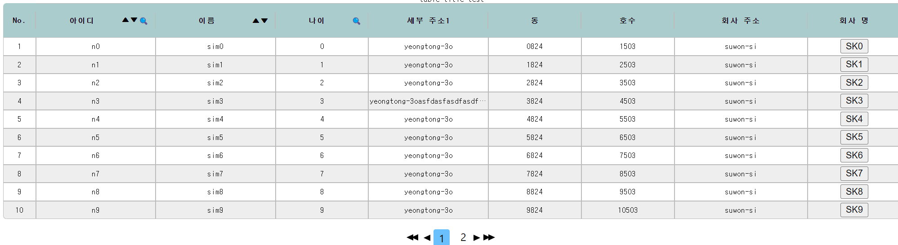
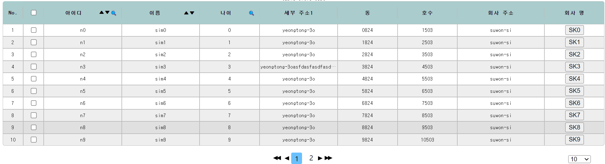
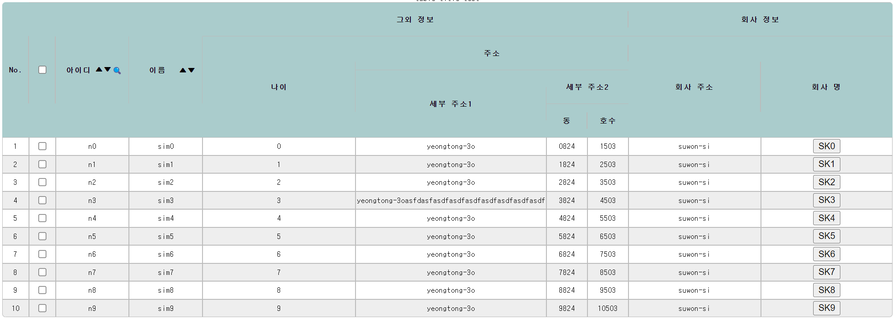

# Hummingbird component

This component library object is react quickly like as most compact library to act fast compare to other library.

## How to start

run below command

```
npm i hummingbird-component
```

## Using like that

### 1. Basic Usage.
#### 1.1 Table


#### 1.2 Sourcecode
```javascript
import {HummingTable} from "hummingbird-component"

...
  let dataLength = 15;

  const columnConfig1 = [
    {
      dataKey:"id",
      label:"아이디",
      width:"12%",
  },
  {
    dataKey:"name",
    label:"이름",
    width:"12%",
  },
  {
    dataKey:"age",
    label:"나이",
    width:"120px",
  },
  {
    dataKey:"street",
    label:"세부 주소1",
    width:"12%",
  },
  {
    dataKey:"building",
    label:"동",
    width:"120px",
  },
  {
    dataKey:"doorNo",
    label:"호수",
    width:"120px",
    
  },
  {
    dataKey:"companyAddress",
    label:"회사 주소",
    width:"180px",
    //width:"18%",
  },
  {
    dataKey:"companyName",
    label:"회사 명",
    width:"120px",
  }
]

let tmpData = []
for(let i = 0 ; i < dataLength ; i++)
{
  
  if(i === 3)
  {
    tmpData.push({
      key: i,
      id : "n"+i,
      name : "sim"+i,
      age: i,
      street: "yeongtong-3oasfdasfasdfasdfasdfasdfasdfasdfasdf",
      building: i+"824",
      doorNo: (i+1)+"503",
      companyAddress: "suwon-si",
      companyName: <button>{"SK"+i}</button>//"SK"+i
    })
  }
  else
  {
    tmpData.push({
      key: i,
      id : "n"+i,
      name : "sim"+i,
      age: i,
      street: "yeongtong-3o",
      building: i+"824",
      doorNo: (i+1)+"503",
      companyAddress: "suwon-si",
      companyName: <button>{"SK"+i}</button>//"SK"+i
    })
  }
}


const [data, setData] = useState(tmpData)

...

return (
    <div className="App">
      test
      <HummingTable 
        columns={columnConfig1}
        dataSource={data}
      ></HummingTable>
      <button onClick={cliskButton}>click</button>
    </div>
  );


```


### 2. Column Sort Usage.
#### 2.1 Table


#### 2.2 Sourcecode
```javascript
import {HummingTable} from "hummingbird-component"

...
  let dataLength = 15;

  const columnConfig1 = [
    {
      dataKey:"id",
      label:"아이디",
      width:"12%",
      sortable: true,
  },
  {
    dataKey:"name",
    label:"이름",
    width:"12%",
    sortable: true,
  },
  {
    dataKey:"age",
    label:"나이",
    width:"120px",
  },
  {
    dataKey:"street",
    label:"세부 주소1",
    width:"12%",
  },
  {
    dataKey:"building",
    label:"동",
    width:"120px",
  },
  {
    dataKey:"doorNo",
    label:"호수",
    width:"120px",
    
  },
  {
    dataKey:"companyAddress",
    label:"회사 주소",
    width:"180px",
  },
  {
    dataKey:"companyName",
    label:"회사 명",
    width:"120px",
  }
]

let tmpData = []
for(let i = 0 ; i < dataLength ; i++)
{
  
  if(i === 3)
  {
    tmpData.push({
      key: i,
      id : "n"+i,
      name : "sim"+i,
      age: i,
      street: "yeongtong-3oasfdasfasdfasdfasdfasdfasdfasdfasdf",
      building: i+"824",
      doorNo: (i+1)+"503",
      companyAddress: "suwon-si",
      companyName: <button>{"SK"+i}</button>//"SK"+i
    })
  }
  else
  {
    tmpData.push({
      key: i,
      id : "n"+i,
      name : "sim"+i,
      age: i,
      street: "yeongtong-3o",
      building: i+"824",
      doorNo: (i+1)+"503",
      companyAddress: "suwon-si",
      companyName: <button>{"SK"+i}</button>//"SK"+i
    })
  }
}


const [data, setData] = useState(tmpData)

...

return (
    <div className="App">
      test
      <HummingTable 
        columns={columnConfig1}
        dataSource={data}
      ></HummingTable>
      <button onClick={cliskButton}>click</button>
    </div>
  );


```


### 3. Column Filter Usage.
#### 3.1 Table


#### 3.2 Sourcecode
```javascript
import {HummingTable} from "hummingbird-component"

...
  let dataLength = 15;

  const columnConfig1 = [
    {
      dataKey:"id",
      label:"아이디",
      width:"12%",
      sortable: true,
      filter: true
  },
  {
    dataKey:"name",
    label:"이름",
    width:"12%",
    sortable: true,
  },
  {
    dataKey:"age",
    label:"나이",
    width:"120px",
    filter: true
  },
  {
    dataKey:"street",
    label:"세부 주소1",
    width:"12%",
  },
  {
    dataKey:"building",
    label:"동",
    width:"120px",
  },
  {
    dataKey:"doorNo",
    label:"호수",
    width:"120px",
    
  },
  {
    dataKey:"companyAddress",
    label:"회사 주소",
    width:"180px",
  },
  {
    dataKey:"companyName",
    label:"회사 명",
    width:"120px",
  }
]

let tmpData = []
for(let i = 0 ; i < dataLength ; i++)
{
  
  if(i === 3)
  {
    tmpData.push({
      key: i,
      id : "n"+i,
      name : "sim"+i,
      age: i,
      street: "yeongtong-3oasfdasfasdfasdfasdfasdfasdfasdfasdf",
      building: i+"824",
      doorNo: (i+1)+"503",
      companyAddress: "suwon-si",
      companyName: <button>{"SK"+i}</button>//"SK"+i
    })
  }
  else
  {
    tmpData.push({
      key: i,
      id : "n"+i,
      name : "sim"+i,
      age: i,
      street: "yeongtong-3o",
      building: i+"824",
      doorNo: (i+1)+"503",
      companyAddress: "suwon-si",
      companyName: <button>{"SK"+i}</button>//"SK"+i
    })
  }
}


const [data, setData] = useState(tmpData)

...

return (
    <div className="App">
      test
      <HummingTable 
        columns={columnConfig1}
        dataSource={data}
      ></HummingTable>
      <button onClick={cliskButton}>click</button>
    </div>
  );


```


### 4. Width/Height Properties Usage.
#### 4.1 Table


#### 4.2 Sourcecode
```javascript
import {HummingTable} from "hummingbird-component"

...
  let dataLength = 15;

  const columnConfig1 = [
    {
      dataKey:"id",
      label:"아이디",
      width:"12%",
      sortable: true,
      filter: true
  },
  {
    dataKey:"name",
    label:"이름",
    width:"12%",
    sortable: true,
  },
  {
    dataKey:"age",
    label:"나이",
    width:"120px",
    filter: true
  },
  {
    dataKey:"street",
    label:"세부 주소1",
    width:"12%",
  },
  {
    dataKey:"building",
    label:"동",
    width:"120px",
  },
  {
    dataKey:"doorNo",
    label:"호수",
    width:"120px",
    
  },
  {
    dataKey:"companyAddress",
    label:"회사 주소",
    width:"180px",
  },
  {
    dataKey:"companyName",
    label:"회사 명",
    width:"120px",
  }
]

let tmpData = []
for(let i = 0 ; i < dataLength ; i++)
{
  
  if(i === 3)
  {
    tmpData.push({
      key: i,
      id : "n"+i,
      name : "sim"+i,
      age: i,
      street: "yeongtong-3oasfdasfasdfasdfasdfasdfasdfasdfasdf",
      building: i+"824",
      doorNo: (i+1)+"503",
      companyAddress: "suwon-si",
      companyName: <button>{"SK"+i}</button>//"SK"+i
    })
  }
  else
  {
    tmpData.push({
      key: i,
      id : "n"+i,
      name : "sim"+i,
      age: i,
      street: "yeongtong-3o",
      building: i+"824",
      doorNo: (i+1)+"503",
      companyAddress: "suwon-si",
      companyName: <button>{"SK"+i}</button>//"SK"+i
    })
  }
}


const [data, setData] = useState(tmpData)

...

return (
    <div className="App">
      test
      <HummingTable 
        width={"80%"}
        height={"100%"}
        columns={columnConfig1}
        dataSource={data}
      ></HummingTable>
      <button onClick={cliskButton}>click</button>
    </div>
  );


```
### 5. Header Style Properties Usage.
#### 5.1 Table


#### 5.2 Sourcecode
```javascript
import {HummingTable} from "hummingbird-component"

...
  let dataLength = 15;
  
  const headerStyle = {
    //가능한 옵션 : backgroundColor, color
    backgroundColor: "#ACC",
    
  }

  const columnConfig1 = [
    {
      dataKey:"id",
      label:"아이디",
      width:"12%",
      sortable: true,
      filter: true
  },
  {
    dataKey:"name",
    label:"이름",
    width:"12%",
    sortable: true,
  },
  {
    dataKey:"age",
    label:"나이",
    width:"120px",
    filter: true
  },
  {
    dataKey:"street",
    label:"세부 주소1",
    width:"12%",
  },
  {
    dataKey:"building",
    label:"동",
    width:"120px",
  },
  {
    dataKey:"doorNo",
    label:"호수",
    width:"120px",
    
  },
  {
    dataKey:"companyAddress",
    label:"회사 주소",
    width:"180px",
  },
  {
    dataKey:"companyName",
    label:"회사 명",
    width:"120px",
  }
]

let tmpData = []
for(let i = 0 ; i < dataLength ; i++)
{
  
  if(i === 3)
  {
    tmpData.push({
      key: i,
      id : "n"+i,
      name : "sim"+i,
      age: i,
      street: "yeongtong-3oasfdasfasdfasdfasdfasdfasdfasdfasdf",
      building: i+"824",
      doorNo: (i+1)+"503",
      companyAddress: "suwon-si",
      companyName: <button>{"SK"+i}</button>//"SK"+i
    })
  }
  else
  {
    tmpData.push({
      key: i,
      id : "n"+i,
      name : "sim"+i,
      age: i,
      street: "yeongtong-3o",
      building: i+"824",
      doorNo: (i+1)+"503",
      companyAddress: "suwon-si",
      companyName: <button>{"SK"+i}</button>//"SK"+i
    })
  }
}


const [data, setData] = useState(tmpData)

...

return (
    <div className="App">
      test
      <HummingTable 
        width={"80%"}
        height={"100%"}
        columns={columnConfig1}
        headerStyle={headerStyle}
        dataSource={data}
      ></HummingTable>
      <button onClick={cliskButton}>click</button>
    </div>
  );


```


### 6. Title Properties Usage.
#### 6.1 Table


#### 6.2 Sourcecode
```javascript
import {HummingTable} from "hummingbird-component"

...
  let dataLength = 15;
  
  const headerStyle = {
    //가능한 옵션 : backgroundColor, color
    backgroundColor: "#ACC",
    
  }

  const columnConfig1 = [
    {
      dataKey:"id",
      label:"아이디",
      width:"12%",
      sortable: true,
      filter: true
  },
  {
    dataKey:"name",
    label:"이름",
    width:"12%",
    sortable: true,
  },
  {
    dataKey:"age",
    label:"나이",
    width:"120px",
    filter: true
  },
  {
    dataKey:"street",
    label:"세부 주소1",
    width:"12%",
  },
  {
    dataKey:"building",
    label:"동",
    width:"120px",
  },
  {
    dataKey:"doorNo",
    label:"호수",
    width:"120px",
    
  },
  {
    dataKey:"companyAddress",
    label:"회사 주소",
    width:"180px",
  },
  {
    dataKey:"companyName",
    label:"회사 명",
    width:"120px",
  }
]

let tmpData = []
for(let i = 0 ; i < dataLength ; i++)
{
  
  if(i === 3)
  {
    tmpData.push({
      key: i,
      id : "n"+i,
      name : "sim"+i,
      age: i,
      street: "yeongtong-3oasfdasfasdfasdfasdfasdfasdfasdfasdf",
      building: i+"824",
      doorNo: (i+1)+"503",
      companyAddress: "suwon-si",
      companyName: <button>{"SK"+i}</button>//"SK"+i
    })
  }
  else
  {
    tmpData.push({
      key: i,
      id : "n"+i,
      name : "sim"+i,
      age: i,
      street: "yeongtong-3o",
      building: i+"824",
      doorNo: (i+1)+"503",
      companyAddress: "suwon-si",
      companyName: <button>{"SK"+i}</button>//"SK"+i
    })
  }
}


const [data, setData] = useState(tmpData)

...

return (
    <div className="App">
      test
      <HummingTable 
        width={"80%"}
        height={"100%"}
        columns={columnConfig1}
        dataSource={data}
        headerStyle={headerStyle}
        title={"table title test"}
      ></HummingTable>
      <button onClick={cliskButton}>click</button>
    </div>
  );


```

### 7. Display Rows / zebra Properties Usage.
#### 7.1 Table


#### 7.2 Sourcecode
```javascript
import {HummingTable} from "hummingbird-component"

...
  let dataLength = 15;
  
  const headerStyle = {
    //가능한 옵션 : backgroundColor, color
    backgroundColor: "#ACC",
    
  }

  const columnConfig1 = [
    {
      dataKey:"id",
      label:"아이디",
      width:"12%",
      sortable: true,
      filter: true
  },
  {
    dataKey:"name",
    label:"이름",
    width:"12%",
    sortable: true,
  },
  {
    dataKey:"age",
    label:"나이",
    width:"120px",
    filter: true
  },
  {
    dataKey:"street",
    label:"세부 주소1",
    width:"12%",
  },
  {
    dataKey:"building",
    label:"동",
    width:"120px",
  },
  {
    dataKey:"doorNo",
    label:"호수",
    width:"120px",
    
  },
  {
    dataKey:"companyAddress",
    label:"회사 주소",
    width:"180px",
  },
  {
    dataKey:"companyName",
    label:"회사 명",
    width:"120px",
  }
]

let tmpData = []
for(let i = 0 ; i < dataLength ; i++)
{
  
  if(i === 3)
  {
    tmpData.push({
      key: i,
      id : "n"+i,
      name : "sim"+i,
      age: i,
      street: "yeongtong-3oasfdasfasdfasdfasdfasdfasdfasdfasdf",
      building: i+"824",
      doorNo: (i+1)+"503",
      companyAddress: "suwon-si",
      companyName: <button>{"SK"+i}</button>//"SK"+i
    })
  }
  else
  {
    tmpData.push({
      key: i,
      id : "n"+i,
      name : "sim"+i,
      age: i,
      street: "yeongtong-3o",
      building: i+"824",
      doorNo: (i+1)+"503",
      companyAddress: "suwon-si",
      companyName: <button>{"SK"+i}</button>//"SK"+i
    })
  }
}


const [data, setData] = useState(tmpData)

...

return (
    <div className="App">
      test
      <HummingTable 
        width={"80%"}
        height={"100%"}
        columns={columnConfig1}
        dataSource={data}
        headerStyle={headerStyle}
        title={"table title test"}
        displayedRowNum="10"
        displayRowNumsYn={true}
        zebra
      ></HummingTable>
      <button onClick={cliskButton}>click</button>
    </div>
  );


```

### 8. Row Selection / SizeChanger / pagination Properties Usage.
#### 8.1 Table


#### 8.2 Sourcecode
```javascript
import {HummingTable} from "hummingbird-component"

...
  let dataLength = 15;
  
  const headerStyle = {
    //가능한 옵션 : backgroundColor, color
    backgroundColor: "#ACC",
    
  }

  const columnConfig1 = [
    {
      dataKey:"id",
      label:"아이디",
      width:"12%",
      sortable: true,
      filter: true
  },
  {
    dataKey:"name",
    label:"이름",
    width:"12%",
    sortable: true,
  },
  {
    dataKey:"age",
    label:"나이",
    width:"120px",
    filter: true
  },
  {
    dataKey:"street",
    label:"세부 주소1",
    width:"12%",
  },
  {
    dataKey:"building",
    label:"동",
    width:"120px",
  },
  {
    dataKey:"doorNo",
    label:"호수",
    width:"120px",
    
  },
  {
    dataKey:"companyAddress",
    label:"회사 주소",
    width:"180px",
  },
  {
    dataKey:"companyName",
    label:"회사 명",
    width:"120px",
  }
]

let tmpData = []
for(let i = 0 ; i < dataLength ; i++)
{
  
  if(i === 3)
  {
    tmpData.push({
      key: i,
      id : "n"+i,
      name : "sim"+i,
      age: i,
      street: "yeongtong-3oasfdasfasdfasdfasdfasdfasdfasdfasdf",
      building: i+"824",
      doorNo: (i+1)+"503",
      companyAddress: "suwon-si",
      companyName: <button>{"SK"+i}</button>//"SK"+i
    })
  }
  else
  {
    tmpData.push({
      key: i,
      id : "n"+i,
      name : "sim"+i,
      age: i,
      street: "yeongtong-3o",
      building: i+"824",
      doorNo: (i+1)+"503",
      companyAddress: "suwon-si",
      companyName: <button>{"SK"+i}</button>//"SK"+i
    })
  }
}


const [data, setData] = useState(tmpData)

...

return (
    <div className="App">
      test
      <HummingTable 
        width={"80%"}
        height={"100%"}
        columns={columnConfig1}
        dataSource={data}
        headerStyle={headerStyle}
        title={"table title test"}
        displayedRowNum="10"
        displayRowNumsYn={true}
        zebra
        sizeChanger={[5, 10, 20, 40]}
        rowSelection={{
          type: rowSelectionType,
          onChange: (selectedRows) => {
            console.log(selectedRows)
          }
        }}
        pagination={{
          //dataLength: 1000,
          onClick: (pageNum) => {
            console.log(pageNum)
          }
        }}
      ></HummingTable>
      <button onClick={cliskButton}>click</button>
    </div>
  );


```


### 9. Group Header Usage.
#### 9.1 Table


#### 9.2 Sourcecode
```javascript
import {HummingTable} from "hummingbird-component"

...
  let dataLength = 15;
  
  const headerStyle = {
    //가능한 옵션 : backgroundColor, color
    backgroundColor: "#ACC",
    
  }

  const columnConfig1 = [
    {
      dataKey:"id",
      label:"아이디",
      width:"8%",
      sortable: true,
      filter: true,
    },
    {
      dataKey:"name",
      label:"이름",
      width:"8%",
      sortable: true,
    },
    {
      dataKey:"other",
      label:"그외 정보",
      width:"50%",
      sortable: false,
      children: [
        {
          dataKey:"age",
          label:"나이",
          width:"20%",
          sortable: false,
        },
        {
          dataKey:"address",
          label:"주소",
          width:"30%",
          sortable: false,
          children: [
            {
              dataKey:"street",
              label:"세부 주소1",
              width:"20%",
              sortable: false,
            },
            {
              dataKey:"block",
              label:"세부 주소2",
              width:"10%",
              sortable: false,
              children: [
                {
                  dataKey:"building",
                  label:"동",
                  width:"5%",
                  sortable: false,
                },
                {
                  dataKey:"doorNo",
                  label:"호수",
                  width:"5%",
                  sortable: false,
                }
              ]
            }
          ]
        }
      ]
    },
    {
      dataKey:"company",
      label:"회사 정보",
      width:"34%",
      sortable: false,
      children:[
        {
          dataKey:"companyAddress",
          label:"회사 주소",
          width:"17%",
          sortable: false,
        },
        {
          dataKey:"companyName",
          label:"회사 명",
          width:"17%",
          sortable: false,
        }
      ]
    }
]

let tmpData = []
for(let i = 0 ; i < dataLength ; i++)
{
  
  if(i === 3)
  {
    tmpData.push({
      key: i,
      id : "n"+i,
      name : "sim"+i,
      age: i,
      street: "yeongtong-3oasfdasfasdfasdfasdfasdfasdfasdfasdf",
      building: i+"824",
      doorNo: (i+1)+"503",
      companyAddress: "suwon-si",
      companyName: <button>{"SK"+i}</button>//"SK"+i
    })
  }
  else
  {
    tmpData.push({
      key: i,
      id : "n"+i,
      name : "sim"+i,
      age: i,
      street: "yeongtong-3o",
      building: i+"824",
      doorNo: (i+1)+"503",
      companyAddress: "suwon-si",
      companyName: <button>{"SK"+i}</button>//"SK"+i
    })
  }
}


const [data, setData] = useState(tmpData)

...

return (
    <div className="App">
      test
      <HummingTable 
        width={"80%"}
        height={"100%"}
        columns={columnConfig1}
        dataSource={data}
        headerStyle={headerStyle}
        title={"table title test"}
        displayedRowNum="10"
        displayRowNumsYn={true}
        zebra
        sizeChanger={[5, 10, 20, 40]}
        rowSelection={{
          type: rowSelectionType,
          onChange: (selectedRows) => {
            console.log(selectedRows)
          }
        }}
        pagination={{
          //dataLength: 1000,
          onClick: (pageNum) => {
            console.log(pageNum)
          }
        }}
      ></HummingTable>
      <button onClick={cliskButton}>click</button>
    </div>
  );


```

